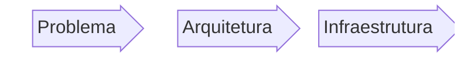
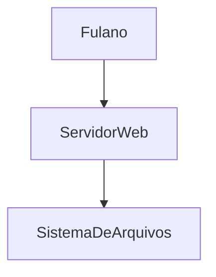
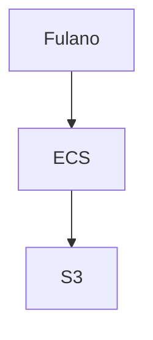

# Exemplo

<Logo />

### Fluxo comum de desenvolvimento:

<v-click>

#### Problema: 

Fulano quer:
- guardar seus arquivos.
- Poder acessar a qualquer momento.
- Não perder nunca.

</v-click>

---
transition: slide-up
---

# Exemplo

#### Arquitetura: 

---
transition: slide-up
---

# Exemplo

#### Infraestrutura: 

ta faltando coisa mas deixa passar

---

# Exemplo

#### Terraform

Agora sim

#### [AWS Provider](https://registry.terraform.io/providers/hashicorp/aws/latest/docs)
