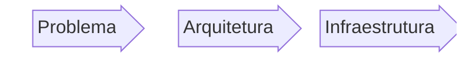
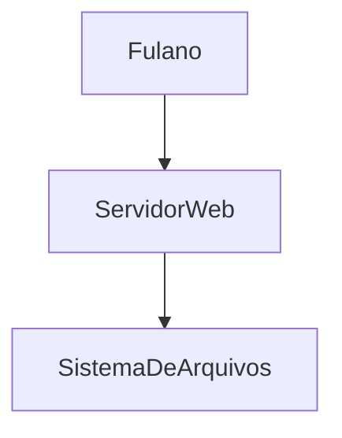
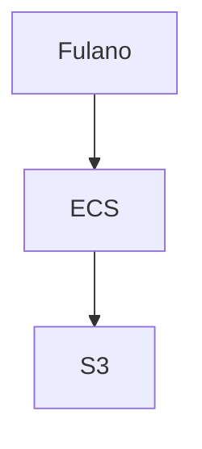

# Exemplo

<Logo />

### Fluxo comum de desenvolvimento:

<v-click>

#### Problema: 

Fulano quer:
- Guardar seus arquivos.
- Poder acessar a qualquer momento.
- Não perder nunca.

</v-click>

---
transition: slide-up
---

# Exemplo

<Logo />

#### Arquitetura: 

Sabendo o problema fica fácil encontrar a solução.

É total interesse do provedor de infra te fornecer soluções.  Sabia que se você fosse uma super empresa, a propria aws iria fazer reuniões com você

A propria aws tem excelentes recursos.

- [Parecido com o que vamos fazer](https://aws.amazon.com/blogs/architecture/building-a-three-tier-architecture-on-a-budget/)
- [Blog com varias soluções](https://aws.amazon.com/blogs/architecture/page/3/)

---
transition: slide-up
---

# Exemplo

<Logo />

#### Infraestrutura: 

Ná prática com certeza teriam mais componentes...

---

# Exemplo

<Logo />

#### Terraform

Agora sim

Vamos:

- Encontrar nossos recursos e como configurar: [AWS Provider](https://registry.terraform.io/providers/hashicorp/aws/latest/docs)
- Configurar o `provider.tf`
- Subir e testar
