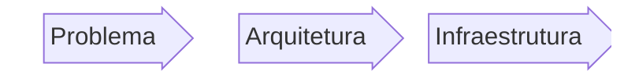

#### Fluxo comum de desenvolvimento

```mermaid
block-beta
    blockArrowId<["Problema"]>(right)
    blockArrowId2<["Arquitetura"]>(right)
    blockArrowId3<["Infraestrutura"]>(right)
```

- Mais a frente veremos um exemplo para fulano

